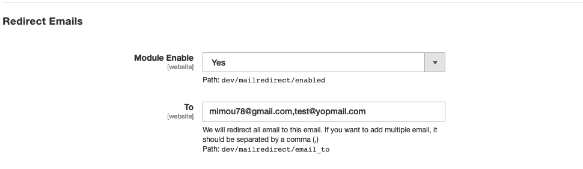

# Magento 2 Mail Redirect

[](//packagist.org/packages/mimou78/magento-2-mail-redirect)
[](//packagist.org/packages/mimou78/magento-2-mail-redirect)
[](//packagist.org/packages/mimou78/magento-2-mail-redirect)

This module allows you to redirect all emails that leave Magento to a specific email. and this in order to prevent customers during the development period from receiving test emails.

## Introduction

The recommended method for testing emails leaving Magento 2 is to use a mailCatcher like:

  * [MailHog](https://github.com/mailhog/MailHog)
  * [MailDev](https://github.com/maildev/maildev)
  * [MailCatcher](https://mailcatcher.me/)


But this is not always easy to setup in all environments and configurations.
Hence the usefulness of this module because it is easy to set up and to use.

## Installation

```
$ composer require "mimou78/magento-2-mail-redirect":"1.0"
$ php bin/magento setup:upgrade
```

## Usage

`Magento Admin > Stores > Configuration > Advanced > Developer > Redirect Emails`



## Developer

[Mohamed El Mrabet](https://www.mohamedelmrabet.com)

## License

[Open Software License ("OSL") v. 3.0](https://opensource.org/licenses/OSL-3.0)
